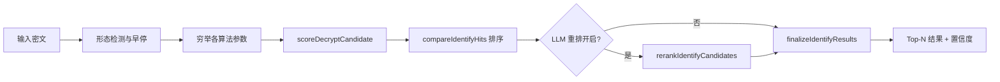

# 智能识别：技术说明

本文说明 **密码学工具箱** 自动识别模块的核心算法：穷举解密、**可读性 / 自然度评分**、往返校验（verified）、以及可选的 **LLM 重排序**。实现代码位于 `backend/src/services/`。

---

## 总体流程

1. **早停**：Base64 / Hex / 摩斯形态等优先走专用分支，减少误报。
2. **穷举**：对凯撒 1–26 移位、维吉尼亚密钥候选、ROT 族等生成解密结果。
3. **打分**：每个候选计算 `score`、`readable`、`verified`。
4. **排序**：同 verified 结果按语料匹配、词典覆盖率、可读分差排序。
5. **LLM（可选）**：对 Top verified 候选做自然语言可读性二次评估并融合分数。
6. **输出**：置信度、与次优差距、是否已校验等元数据。

---

## 可读性与自然度评分

识别不依赖单一「使用率」指标，而是多层评分叠加。下表为各模块职责：

| 模块 | 文件 | 作用 |
|------|------|------|
| 英文可读性 | `engine.js` → `scorePlaintext` | 字母频率、词典词、英文 IC、空格与标点 |
| 多语言可读性 | `unicodeCipher.js` → `scorePlaintextMultilingual` | CJK / 假名 / 韩文常用字覆盖 |
| **中文自然度** | `zhFreqCorpus.js` → `scoreZhNaturalness` | 字频 log + 2/3-gram 语料概率 + 生僻字惩罚 |
| **英文词典覆盖率** | `engine.js` → `scoreEnglishLexicon` | 凯撒多移位消歧（如 `ATTACK AT DAWN` vs 误报） |
| 综合可读分 | `identifyScore.js` → `scoreReadableText` | 上述分数加权合并 |
| 语料命中 | `exampleCorpus` / `bibleCorpus` / `classicCorpus` | 名言、和合本、四大名著精确或 tier 匹配 |

### 中文自然度算法（`scoreZhNaturalness`）

语料来源：**四大名著句库**、**示例句库**、**口语 slang 文件**、现代短句（如「康神开播了」），启动时构建：

- 单字频率 `charFreq`
- 二字组 `bigramFreq`、三字组 `trigramFreq`

对候选明文计算：

1. 各汉字 log 概率均值（拉普拉斯平滑 `SMOOTH=0.5`）
2. 2-gram / 3-gram 对数概率加成
3. 扩展区 / 生僻 CJK 字符惩罚
4. 映射到 **0–100** 自然度分

短句纯中文解密若自然度过低，会降权或取消 `verified`，抑制「乱移位汉字」误报。

### 英文词典覆盖率（`scoreEnglishLexicon`）

对纯英文凯撒类候选：

- 词典命中词 +1，长未知词（≥4 字母）−0.65
- 覆盖率 = 加权命中 / 词数，范围 0–1
- 在 `scoreDecryptCandidate` 中：`score += lex × 28`，并对未知长词额外扣分
- 在 `compareIdentifyHits` 中：verified 且结果不同时，优先词典覆盖率更高者

用于解决 `EXXEGO EX HEAR`（含 `hear`）压过 `ATTACK AT DAWN` 类问题。

### 候选打分（`scoreDecryptCandidate`）

主要规则摘要：

| 条件 | 效果 |
|------|------|
| 解密可读分 − 输入可读分 ≥ 20 | +12 加成 |
| 标点数量保持或增加 | +10 |
| 摩斯形态输入 | +18 |
| `verifyRoundtrip` 成功 | 标记 verified，并按算法族加减权 |
| 乱码 trivial 变换（upside-down 等）对 Unicode 密文 | 大幅降权 |
| 纯英文凯撒 + 低词典覆盖 | 限制 verified |

**verified** 含义：用同一算法与参数将解密结果 **再加密** 能还原原密文（JWT、摩斯等有特例处理）。流密码 RC4/XOR 等「任意明文可往返」的算法需结合可读分才可信。

### 排序（`compareIdentifyHits`）

优先级大致为：

1. 已是明文 > 加密结果
2. verified > 未 verified
3. 混排自然句 > 纯拉丁乱码
4. 语料 tier（和合本 / 名著 / 示例）
5. 英文词典覆盖率（凯撒族）
6. readable 分差 ≥ 10
7. 原始 score

---

## 可选：LLM 重排序

> 代码：`backend/src/services/identifyLlmRerank.js`  
> 默认 **关闭**，不影响离线识别与 CI。

### 何时启用

| 方式 | 说明 |
|------|------|
| 环境变量 | `IDENTIFY_LLM_RERANK=1` 且配置 `OPENAI_API_KEY` |
| API 请求体 | `POST /api/ciphers/identify` 传 `"llmRerank": true` |

### 工作流程

1. 同步识别得到已排序候选列表
2. 取 Top **5** 个 **verified** 且结果互异的候选组成 pool
3. 调用 Chat Completions（默认 `gpt-4o-mini`），要求返回 JSON：`{"1":0.92,"2":0.15,...}` 表示各候选「像正确解密的自然度」
4. **融合分数**：`score = round(base × 0.6 + llmScore × 100 × 0.4)`
5. 按 `compareIdentifyHits` 重新排序
6. 相同密文+候选池 **内存缓存**，避免重复计费

### 环境变量

| 变量 | 默认 | 说明 |
|------|------|------|
| `IDENTIFY_LLM_RERANK` | 未设置 | 设为 `1` 启用 |
| `OPENAI_API_KEY` | — | API 密钥（必填） |
| `IDENTIFY_LLM_BASE_URL` | `https://api.openai.com/v1` | 兼容 OpenAI 协议的中转 |
| `IDENTIFY_LLM_MODEL` | `gpt-4o-mini` | 模型名 |

示例见仓库根目录 [`.env.example`](../.env.example)。

### 设计原则

- **LLM 只做重排，不做穷举**：算法层仍负责候选生成与 verified 校验，避免幻觉直接当解密结果。
- **失败静默降级**：无 Key、HTTP 错误或 JSON 解析失败时返回原排序。
- **成本可控**：仅多候选且 verified≥2 时调用；pool 上限 5；有缓存。

---

## 容易出现的误区

阅读或讨论本项目识别模块时，下列说法容易与实现不符：

### 误区 1：LLM 参与加解密或生成解密结果

- **实际**：加解密在 `registry.js` 各算法的规则内完成；识别靠穷举参数 + 规则打分 + `verifyRoundtrip`。
- **LLM 只做一件事**：在多个 **已通过往返校验** 的候选明文之间，按可读性 **重排**，见 `identifyLlmRerank.js`。

### 误区 2：没有 LLM 就无法识别 / 输出全是乱码

- **实际**：LLM **默认关闭**；压测、CI、E2E 均不依赖 LLM。
- 候选排序主要靠 **字频/2-3gram 自然度**、**英文词典覆盖率**、**语料命中**、**字母 IC/频率** 等；乱码候选会被降权或取消 verified。

### 误区 3：LLM 负责「语序排序」或 NLP 断句

- **实际**：不做语序恢复。凯撒/维吉尼亚等在 **字符或 Unicode 码点** 上变换；识别是对多种算法假设各解出一版字符串，再比较哪版更像自然语言。
- 与 Transformer **位置编码 / Embedding**（训练阶段内部表示）不是同一问题。

### 误区 4：可选 LLM 层等于密码学或 LLM 方向的研究创新

- **实际**：LLM 层是 **rerank 插件**（约 60% 规则分 + 40% LLM 分），可整段关闭。
- 识别侧工程重点在：**穷举 + verified + 中文语料自然度**；仓库整体是 **多算法集成工具**，不是新密码体制。

---

## 置信度与前端展示

`finalizeIdentifyResults` 根据：

- 最高与次高 score 差距（`scoreGap`）
- verified 比例
- readable 水平

划分 `confidenceLevel`：`high` / `medium` / `low`，并映射为 0–100 的 `confidence` 百分比。差距小且多候选接近时标记低置信，提示用户查看「其他可能」。

---

## 扩展与贡献

| 目标 | 建议 |
|------|------|
| 新算法识别 | 在 `registry.js` 注册并实现 `getIdentifyParams` 穷举参数 |
| 中文误报 | 向 `zhFreqCorpus.js` / slang 语料加句；或 `test-identify-polish.js` 加用例 |
| 英文凯撒 | 扩充 `engine.js` `WORD_SET`；调整 `scoreEnglishLexicon` 权重 |
| LLM 提示词 | 修改 `identifyLlmRerank.js` 中 `buildPrompt`，PR 请附 A/B 样例 |

提交 PR 前请运行 `npm test` 与 `npm run test:e2e`，详见 [CONTRIBUTING.md](../CONTRIBUTING.md)。
